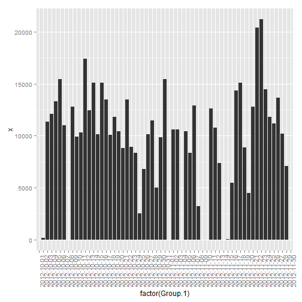
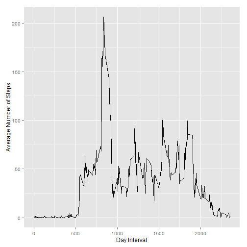
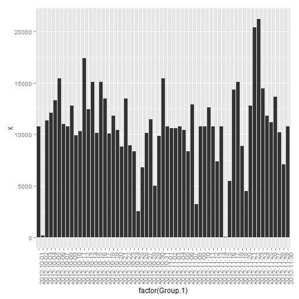
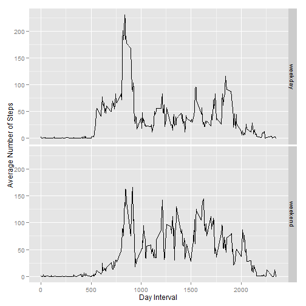

# Activity Monitoring Data Assignment

<br><br>

### Loading and preprocessing the data

#### 1 . Load the data


```r
# assumes the unzipped file is saved on R default directory
data <- read.csv("activity.csv")
```

#### 2. Process/transform the data (if necessary) into a format suitable for analysis

No 'central' data pre-processing carried out. Data manipulation routines are carried out within each section just before building each plot or doing calculations.

This report assumes ggplot2 package is already installed and loaded in R.


```r
# perform a quick check of number of rows and columns as well as data structure
dim(data)
```

```
## [1] 17568     3
```

```r
head(data,2)
```

```
##   steps       date interval
## 1    NA 2012-10-01        0
## 2    NA 2012-10-01        5
```

```r
summary(data)
```

```
##      steps               date          interval   
##  Min.   :  0.0   2012-10-01:  288   Min.   :   0  
##  1st Qu.:  0.0   2012-10-02:  288   1st Qu.: 589  
##  Median :  0.0   2012-10-03:  288   Median :1178  
##  Mean   : 37.4   2012-10-04:  288   Mean   :1178  
##  3rd Qu.: 12.0   2012-10-05:  288   3rd Qu.:1766  
##  Max.   :806.0   2012-10-06:  288   Max.   :2355  
##  NA's   :2304    (Other)   :15840
```

<br><br>

### What is mean total number of steps taken per day?

For this part of the assignment, missing values in the dataset are ignored.

#### 1. Make a histogram of the total number of steps taken each day


```r
# aggregates steps by date
aggreg_steps_by_date <- aggregate(data$steps, by=list(data$date), FUN = sum, na.rm = TRUE)

# build histogram using ggplot2
ggplot(data=aggreg_steps_by_date, aes(factor(Group.1), x)) + geom_bar(stat='identity') +
  theme(axis.text.x = element_text(angle=90, vjust=1))
```

 

#### 2.Calculate and report the mean and median total number of steps taken per day (ignoring missing values)


```r
paste("The mean total number of steps taken per day is ", format(mean(aggreg_steps_by_date$x), nsmall=2))
```

```
## [1] "The mean total number of steps taken per day is  9354.23"
```

```r
paste("The median total number of steps taken per day is ", format(median(aggreg_steps_by_date$x), nsmall=2))
```

```
## [1] "The median total number of steps taken per day is  10395"
```


<br><br>

### What is the average daily activity pattern?

#### 1. Make a time series plot (i.e. type = "l") of the 5-minute interval (x-axis) and the average number of steps taken, averaged across all days (y-axis)


```r
# obtains mean steps by interval
mean_steps_by_interval <- aggregate(data$steps, by=list(data$interval), FUN = mean, na.rm = TRUE)

# build time series plot using ggplot2
ggplot(mean_steps_by_interval, aes(Group.1, x)) + geom_line() + 
  xlab("Day Interval") + ylab("Average Number of Steps")
```

 

#### 2. Which 5-minute interval, on average across all the days in the dataset, contains the maximum number of steps?


```r
paste("The 5-minute interval with the maximum average number of steps is ", 
      mean_steps_by_interval[which.max(mean_steps_by_interval$x),1])
```

```
## [1] "The 5-minute interval with the maximum average number of steps is  835"
```


<br><br>

### Imputing missing values

There are a number of days/intervals where there are missing values (coded as NA in the steps column). The presence of missing days may introduce bias into some calculations or summaries of the data.

#### 1. Calculate and report the total number of missing values in the dataset (i.e. the total number of rows with NAs)


```r
paste("The total number of missing values in the dataset (steps column*) is", sum(is.na(data$steps)))
```

```
## [1] "The total number of missing values in the dataset (steps column*) is 2304"
```

* Interval and Date column do not have any missing values.

#### 2. Devise a strategy for filling in all of the missing values in the dataset. The strategy does not need to be sophisticated. For example, you could use the mean/median for that day, or the mean for that 5-minute interval, etc.

The strategy chosen is as follows:

- Merge the average steps by interval (previusly calculated and assigned to 'mean_steps_by_interval' data.frame) onto the main dataset ('data' data.frame)

- This merged average number of steps by interval is then used to fill each NA value found in steps column in the main dataset ('data' data.frame).


```r
# tidy up headers of data.frame containing average steps by interval 
# so it can then merged with main dataset
names(mean_steps_by_interval) <- c("interval", "mean")

# merge average steps by interval data.frame with main dataset 
mergeddata <- merge(data, mean_steps_by_interval, by = "interval")

# Fill each NA value in steps column with average steps by interval (for that respective interval). 
# Values used to fill NAs had to be converted to characters for substitution process 
mergeddata$steps[is.na(mergeddata$steps)] <- as.character(mergeddata$mean[is.na(mergeddata$steps)])
```

#### 3. Create a new dataset that is equal to the original dataset but with the missing data filled in.


```r
# Extract relevant columns from merged dataset obtained in previous section 
data_filled_NA <- mergeddata[c(1:3)]

# COnvert steps column class back to numeric
data_filled_NA$steps <- as.numeric(data_filled_NA$steps)
```

#### 4. Make a histogram of the total number of steps taken each day and Calculate and report the mean and median total number of steps taken per day. Do these values differ from the estimates from the first part of the assignment? What is the impact of imputing missing data on the estimates of the total daily number of steps?

The histogram code and plot are provided below.


```r
aggreg_steps_by_date_filled_NA <- aggregate(data_filled_NA$steps, 
  by=list(data_filled_NA$date), FUN = sum, na.rm = TRUE)
ggplot(data=aggreg_steps_by_date_filled_NA, aes(factor(Group.1), x)) + 
  geom_bar(stat='identity') + theme(axis.text.x = element_text(angle=90, vjust=1))
```

 

The mean and median for datasetwith filled NAs are higher than the mean/median calculated for the dataset ignoring missing values (NAs).


```r
paste("The mean total number of steps taken per day for the dataset with filled NAs is ", 
      format(mean(aggreg_steps_by_date_filled_NA$x), nsmall=2))
```

```
## [1] "The mean total number of steps taken per day for the dataset with filled NAs is  10766.19"
```

```r
paste("The median total number of steps taken per day for the dataset with filled NAs is ", 
      format(median(aggreg_steps_by_date_filled_NA$x), nsmall=2))
```

```
## [1] "The median total number of steps taken per day for the dataset with filled NAs is  10766.19"
```

<br><br>

### Are there differences in activity patterns between weekdays and weekends?

The weekdays() function was used for this section to introduce a new factor variable to the dataset with the filled-in missing values.

#### 1. Create a new factor variable in the dataset with two levels - "weekday" and "weekend" indicating whether a given date is a weekday or weekend day.


```r
weekday <- c("Monday", "Tuesday", "Wednesday", "Thursday", "Friday")
data_filled_NA$type_day <- with(data_filled_NA, 
  ifelse(weekdays(as.Date(data_filled_NA$date)) %in% weekday,"weekday", "weekend"))
```

#### 2. Make a panel plot containing a time series plot (i.e. type = "l") of the 5-minute interval (x-axis) and the average number of steps taken, averaged across all weekday days or weekend days (y-axis). 


```r
mean_steps_by_interval_filled_NA <- aggregate(data_filled_NA$steps, 
    by=list(data_filled_NA$interval,data_filled_NA$type_day), FUN = mean, na.rm = TRUE)

# ggplot2 package was used to plot time series
ggplot(mean_steps_by_interval_filled_NA, aes(Group.1, x)) + geom_line() + 
  xlab("Day Interval") + ylab("Average Number of Steps") + facet_grid(Group.2~.)
```

 


